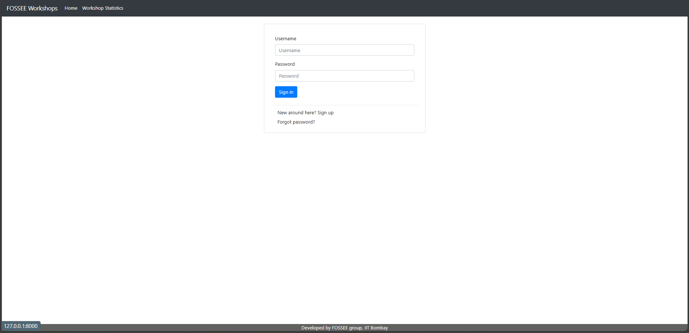
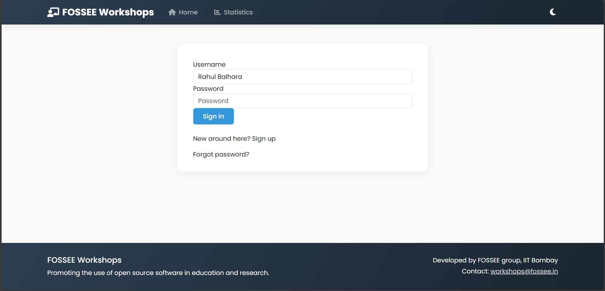
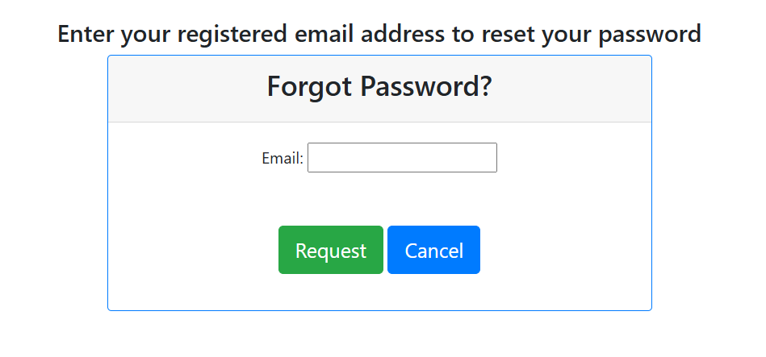
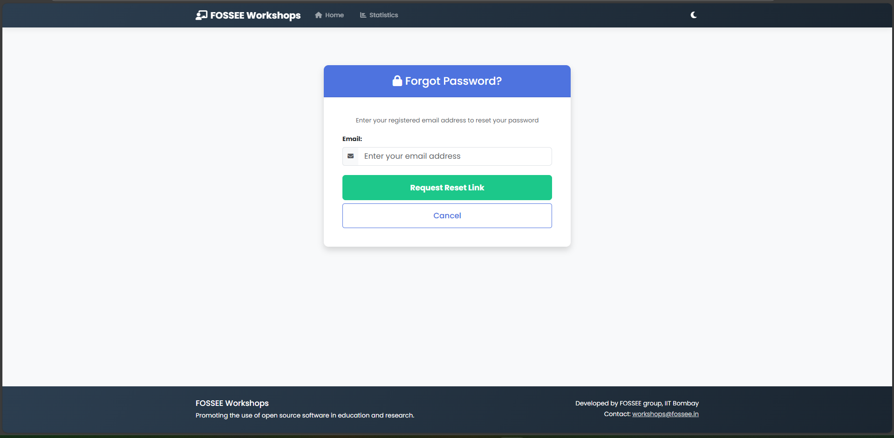
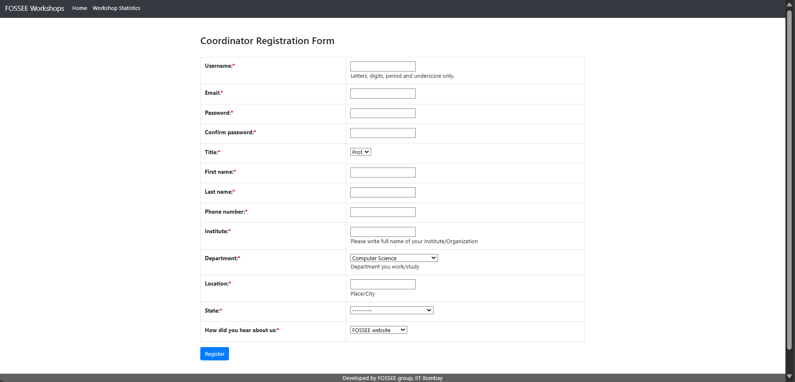
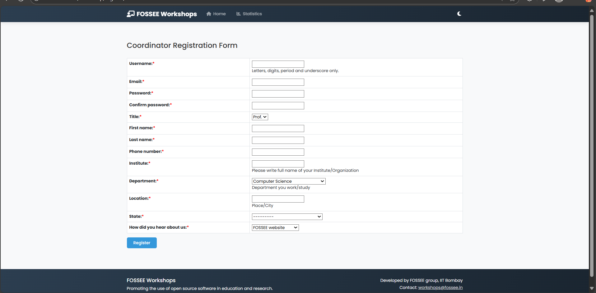
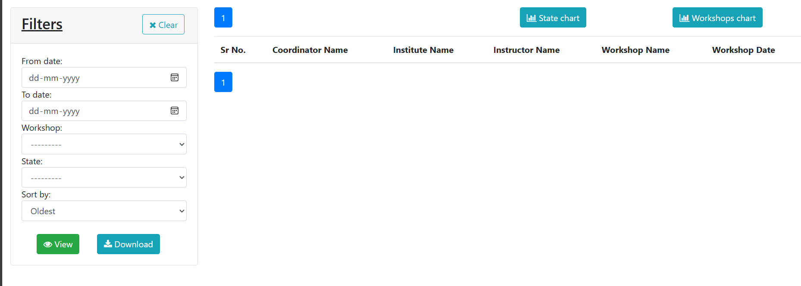
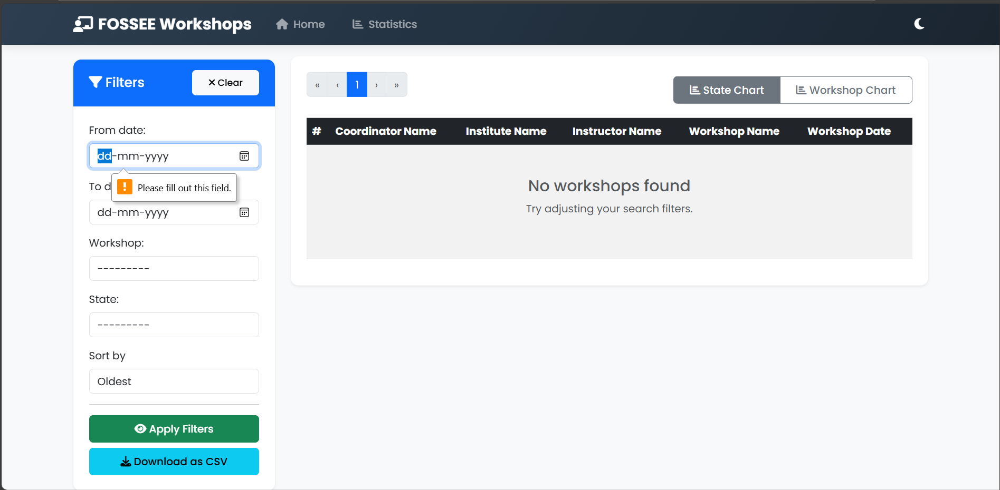

## 📖 About The Project

This project enhances the user interface and experience of the existing FOSSEE Workshop Booking system. The original site was minimal and functional, but needed improvements in visual design, mobile responsiveness, and user flow.

**Key Improvements:**
*   **Mobile-First Design:** Complete responsive redesign optimized for mobile devices
*   **Modern UI:** Clean, professional interface using Bootstrap 5
*   **Improved Navigation:** Intuitive navigation and information architecture
*   **Enhanced Accessibility:** Better contrast, larger touch targets, and semantic HTML
*   **Performance Optimization:** Minimized CSS/JS and optimized assets

### Before and After Screenshots

| Page | Before | After |
|------|--------|-------|
| Homepage |  |  |
| Password setup |  |  |
| Registration form|  |  |
| Statistics|  |  |

## 🛠️ Built With

*   [Bootstrap 5](https://getbootstrap.com/) - Frontend framework for responsive design
*   [Vanilla JavaScript](https://developer.mozilla.org/en-US/docs/Web/JavaScript) - For interactive elements
*   [CSS3](https://developer.mozilla.org/en-US/docs/Web/CSS) - Custom styling
*   [HTML5](https://developer.mozilla.org/en-US/docs/Web/HTML) - Semantic markup

## 💻 Getting Started

### Prerequisites

*   A modern web browser (Chrome, Firefox, Safari, Edge)
*   A local web server (for running locally) - Python

### Installation

check : docs/Getting_Started.md for intallation of the project.

## 🧠 Design Rationale

### What design principles guided your improvements?

I followed several key design principles:
- **Mobile-First Approach:** Designed for mobile devices first, then scaled up to larger screens
- **Visual Hierarchy:** Used size, color, and spacing to guide users' attention to important elements
- **Accessibility:** Ensured sufficient color contrast, semantic HTML, and keyboard navigation support
- **Minimalism:** Removed unnecessary elements to reduce cognitive load

### How did you ensure responsiveness across devices?

- Implemented a responsive grid system using Bootstrap's 12-column layout
- Used responsive utility classes for showing/hiding elements on different screen sizes
- Designed touch-friendly interfaces with appropriately sized buttons and form controls
- Tested across multiple device sizes using browser developer tools
- Used flexible units (%, rem, em) instead of fixed pixels where appropriate

### What trade-offs did you make between the design and performance?

- Used Bootstrap framework for rapid development vs. writing custom CSS (slightly larger file size)
- Added subtle animations for better UX vs. potential performance impact (kept them minimal)
- Included Bootstrap icons for visual appeal vs. additional HTTP requests (used CDN for caching benefits)
- Prioritized mobile experience which meant some desktop layouts had more white space

### What was the most challenging part of the task and how did you approach it?

The most challenging aspect was modernizing the interface while maintaining all the original functionality. The existing codebase had minimal structure, so I:

1. **Analyzed the existing functionality** to ensure no features were lost
2. **Created a component-based approach** to rebuild the UI systematically
3. **Implemented progressive enhancement** to ensure the site worked even without JavaScript
4. **Conducted usability testing** with a focus on mobile devices to identify pain points
5. **Iterated on the design** based on testing feedback while keeping the code clean and maintainable

## 📱 UX Scenario Implementation

Considering the primary users are students on mobile devices, I:

- **Optimized forms** with appropriate input types (email, tel, etc.) and validation
- **Increased touch target sizes** for all interactive elements (minimum 44x44px)
- **Simplified navigation** with a collapsible navbar and clear call-to-action buttons
- **Improved readability** with appropriate font sizes, line heights, and contrast
- **Reduced data entry** with smart defaults and autocomplete where possible
- **Minimized page load times** by optimizing assets and using efficient code

## 🤝 Contributing

If you have a suggestion that would make this better, please fork the repo and create a pull request. You can also simply open an issue with the tag "enhancement".

1. Fork the project
2. Create your feature branch (`git checkout -b feature/AmazingFeature`)
3. Commit your changes (`git commit -m 'Add some AmazingFeature'`)
4. Push to the branch (`git push origin feature/AmazingFeature`)
5. Open a Pull Request

## 📜 License

Distributed under the MIT License. See `LICENSE` for more information.

## 📞 Contact

Rahul Balhara - [rahulbalhara821@gmail.com](mailto:rahulbalhara821@gmail.com)

Project Link: [https://github.com/RahulBalhara/Task1.git](https://github.com/RahulBalhara/Task1.git)m
